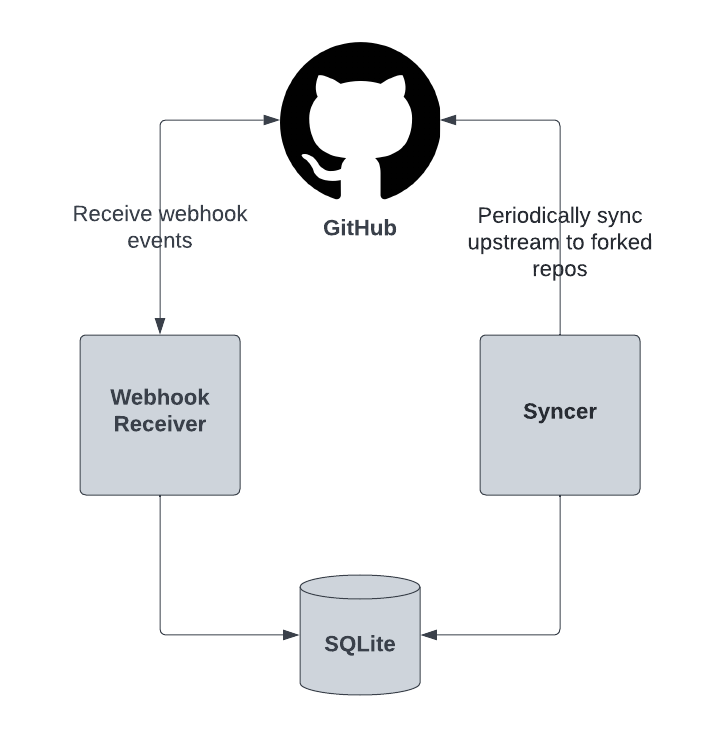

# Magic Mirror

Magic Mirror is a [GitHub App](https://docs.github.com/en/developers/apps/getting-started-with-apps/about-apps) that
mirrors (cherry picks) merged upstream pull-requests (PR) to configured forked repository's branches. It does this by
creating cherry pick PRs on the forked repository and automatically merging them if the PR CI passes. This also has the
added benefit of documenting each upstream PR that is synced.

If a sync from upstream fails, a GitHub issue is created on the forked repository. In that event, Magic Mirror will
pause syncing the forked repository's branch that failure occurred on until the GitHub issue is closed. Therefore,
closing the GitHub issue signals to Magic Mirror that the failed sync was manually corrected or can be ignored.

## GitHub Installation

Installing Magic Mirror on a particular GitHub repository indicates that it should be synced with upstream. Additional
configuration as described in the [Configuration](#configuration) section is still required.

### Permissions

The GitHub App requires the following repository permissions:

- [Checks](https://docs.github.com/en/rest/overview/permissions-required-for-github-apps#permission-on-checks) read
  access. This is needed to verify that the CI on a PR has passed.
- [Contents](https://docs.github.com/en/rest/overview/permissions-required-for-github-apps#permission-on-contents) read
  and write access. This is needed so that repository can be cloned and a branch created with the cherry picked upstream
  commits.
- [Issues](https://docs.github.com/en/rest/overview/permissions-required-for-github-apps#permission-on-issues) read and
  write access. This is needed so that the a GitHub issue can be created if a sync from upstream fails.
- [Metadata](https://docs.github.com/en/rest/overview/permissions-required-for-github-apps#metadata-permissions) read
  access. This is mandatory for all GitHub apps.
- [Pull requests](https://docs.github.com/en/rest/overview/permissions-required-for-github-apps#permission-on-pull-requests)
  read and write access. This is needed so that PRs can be created and closed.

### Events

The GitHub app requires being subscribed to the following events:

- [Check suite](https://docs.github.com/en/developers/webhooks-and-events/webhooks/webhook-events-and-payloads#check_suite)
- [Issues](https://docs.github.com/en/developers/webhooks-and-events/webhooks/webhook-events-and-payloads#issues)
- [Pull request](https://docs.github.com/en/developers/webhooks-and-events/webhooks/webhook-events-and-payloads#pull_request)

## Configuration

The configuration file must be present at `./config.json` or `/etc/magic-mirror/config.json`.

- `appID` - the GitHub App ID that is used during authentication with the GitHub API.
- `dbPath` - an optional path to the SQLite database to use or create. This defaults to
  `/etc/magic-mirror/magic-mirror.db`.
- `logLevel` - an optional log level to set. This defaults to `info`. Other options include `debug` or `error`.
- `privateKeyPath` - an optional path to the GitHub App private key used during authentication with the GitHub API. This
  defaults to `/etc/magic-mirror/auth.key`.
- `syncInterval` - an optional interval in seconds for how often Magic Mirror should check for new merged upstream PRs.
  This defaults to `30`.
- `upstreamMappings` - the object that determines which upstream branches should be synced to which fork branches. See
  the example configure below for a better understanding.
- `webhookSecret` - the optional secret that the GitHub webhook event must provide for it to be processed.

Below is an example configuration that syncs from the `main` and `release-0.7` branches in the
`open-cluster-management-io` GitHub organization to the `release-2.6` and `release-2.5` branches in the `stolostron`
GitHub organization respectively. Note that the repositories that are synced would be determined based on which
`stolostron` repositories by the same name as in `open-cluster-management-io` are selected in the GitHub App
installation.

```json
{
  "appID": 2,
  "dbPath": "/etc/magic-mirror/magic-mirror.db",
  "logLevel": "info",
  "privateKeyPath": "/etc/magic-mirror/auth.key",
  "syncInterval": 30,
  "upstreamMappings": {
    "stolostron": {
      "open-cluster-management-io": {
        "branchMappings": {
          "main": "release-2.6",
          "release-0.7": "release-2.5"
        }
      }
    }
  },
  "webhookSecret": "my-secret"
}
```

## Deployment

### Architecture



### Prerequisites

- [Create](https://docs.github.com/en/developers/apps/building-github-apps/creating-a-github-app) a GitHub App in the
  GitHub organization with the forks.
  - Set the webhook URL to the root of where you plan to deploy Magic Mirror.
  - Set the documented [permissions](#permissions) and webhook [events](#events).
  - Set a webhook secret.
- Create a `config.json` file based on the [documentation](#configuration).
- [Download](https://docs.github.com/en/developers/apps/building-github-apps/authenticating-with-github-apps#generating-a-private-key)
  a generated private key of your GitHub App and name it `auth.key`.

### Kubernetes

After completing the [prerequisites](#prerequisites), start by creating a namespace to deploy Magic Mirror in.

```shell
kubectl create namespace magic-mirror
```

Create the Kubernetes secret to contain the `config.json` and `auth.key` files setup during the
[prerequisite](#prerequisites) steps.

```shell
kubectl create -n magic-mirror secret generic magic-mirror-config --from-file=config.json --from-file=auth.key
```

Then fill out a `values.yaml` file to customize the [Helm chart's](helm/) default [values.yaml](helm/values.yaml) file.
Below is an example that utilizes [OpenShift's](https://www.redhat.com/en/technologies/cloud-computing/openshift)
default certificate for TLS termination.

```yaml
ingress:
  # Change this to the actual external DNS name that GitHub will use to send webhook events.
  host: magic-mirror.apps.openshift.example.com
  annotations:
    route.openshift.io/termination: edge

configSecret: magic-mirror-config
```

Once you are happy with your `values.yaml` file, you may install Magic Mirror using the following Helm command from the
root of the Git repository.

```shell
helm install magic-mirror ./helm -f values.yaml --namespace=magic-mirror
```
